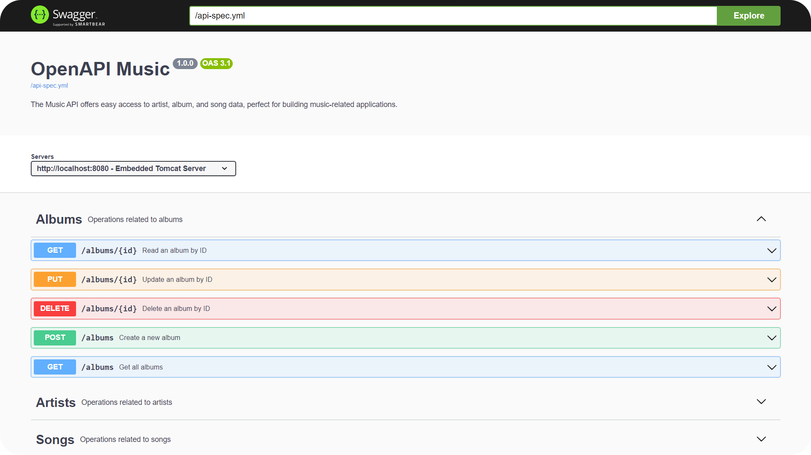

<h1 align="center">
  <🎵> Music Rest API
</h1>

  Simple Spring API for managing music data with <em>CRUD endpoints</em>.
   
  Built with <strong>Spring JPA</strong>, <strong>H2</strong> — explore via <a href="http://localhost:8080/swagger-ui/index.html">Swagger UI</a> 🎧

## 🪄 Swagger UI

