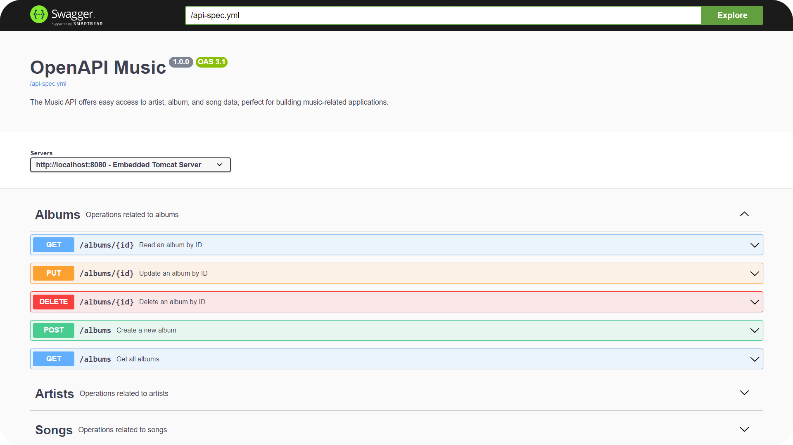

<h1 align="center">
  <> API Rest Musical
</h1>

## Resumen Proyecto

Este proyecto es una **API Rest Musical** desarrollada usando _Spring JPA_, _H2 Database_, y _Swagger UI_ para la documentación.

Permite gestionar datos relacionados con la música mediante operaciones CRUD.

Puedes explorar y probar la API utilizando la interfaz de [Swagger UI](http://localhost:8080/swagger-ui/index.html).

 

##  Swagger UI

