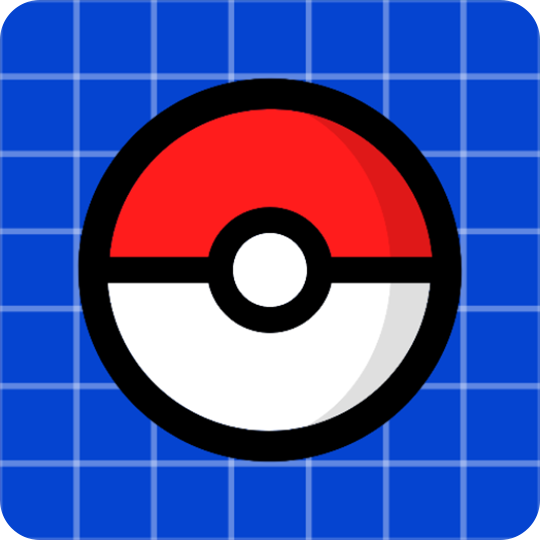
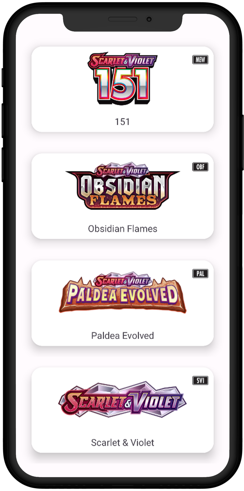
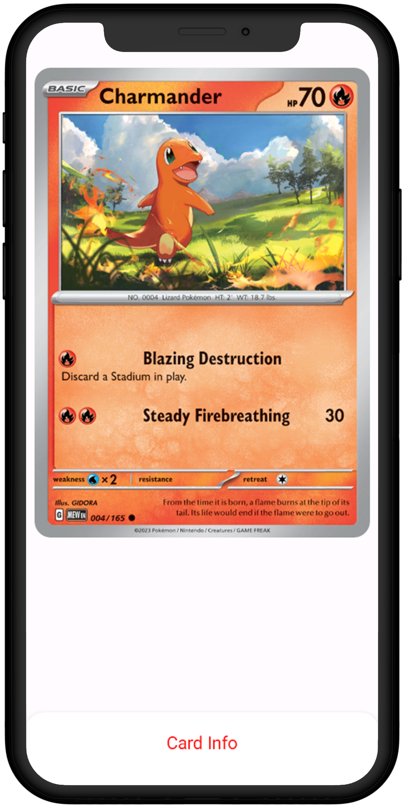
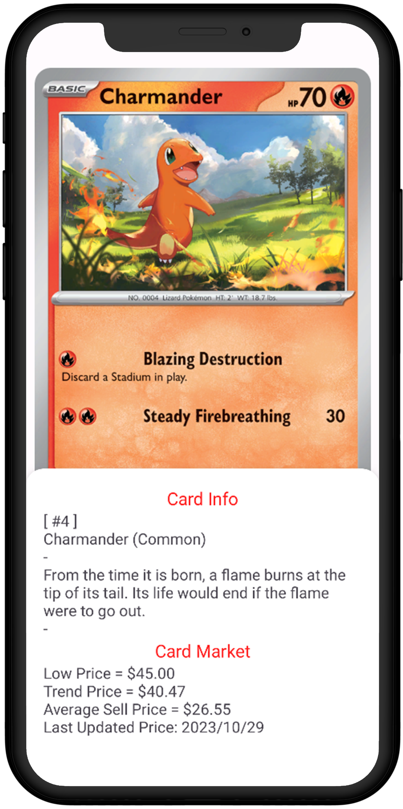

<h1 align="center">
  <🐦> PokeStats
</h1>

## Project Overview

PokeStats is a mobile app that allows users to search for the sets and their respective cards available in **PokemonTCG**.

This application leverages the power of the [PokemonTCG.io](https://pokemontcg.io) API.

API manipulation is done via [Retrofit](https://square.github.io/retrofit).

 

## 🎨 UI Design

|                                                                              Sets Screen                                                                               |                                                                               Cards Screen                                                                                |                                                                                 Details Screen                                                                                  |                                                                                Sheets Screen                                                                                 |
|:----------------------------------------------------------------------------------------------------------------------------------------------------------------------:|:-------------------------------------------------------------------------------------------------------------------------------------------------------------------------:|:-------------------------------------------------------------------------------------------------------------------------------------------------------------------------------:|:----------------------------------------------------------------------------------------------------------------------------------------------------------------------------:|
| <picture><source media="(prefers-color-scheme: dark)" srcset="docs/imgs/dark/screen-sets.png"></picture> | <picture><source media="(prefers-color-scheme: dark)" srcset="docs/imgs/dark/screen-cards.png"></picture> | <picture><source media="(prefers-color-scheme: dark)" srcset="docs/imgs/dark/screen-details.png"></picture> | <picture><source media="(prefers-color-scheme: dark)" srcset="docs/imgs/dark/screen-sheets.png"></picture> |