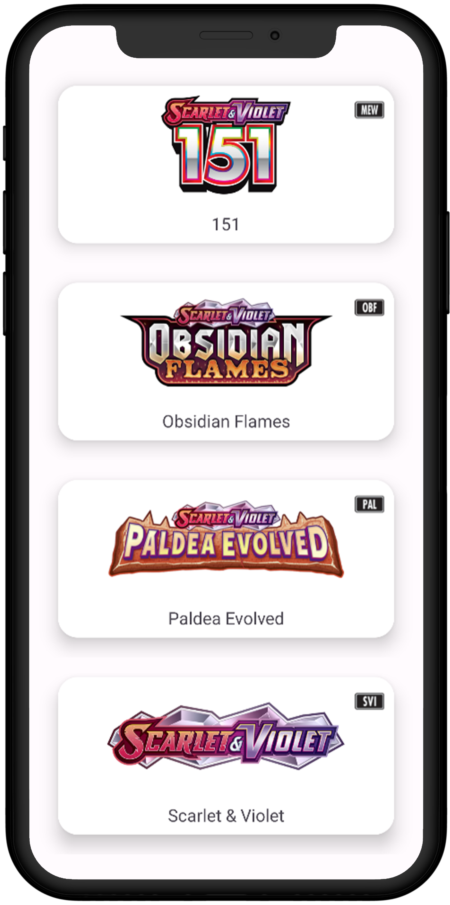
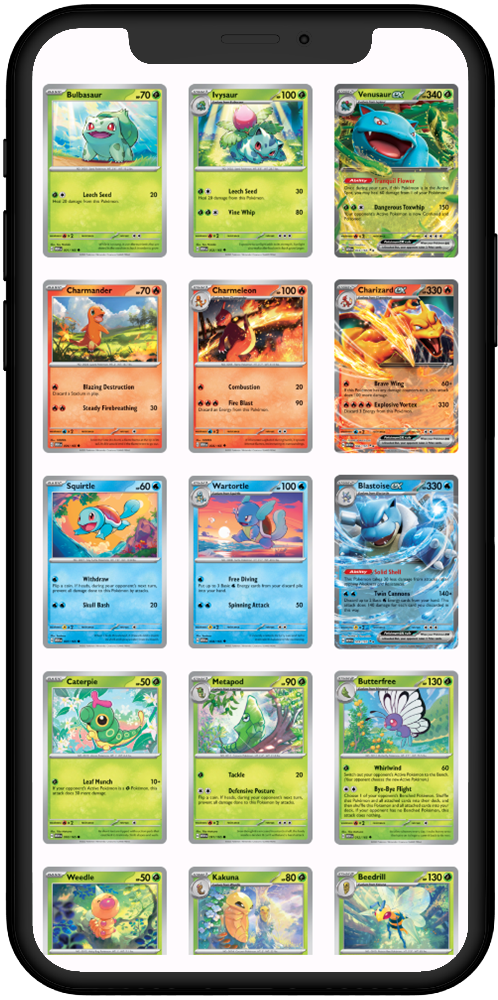
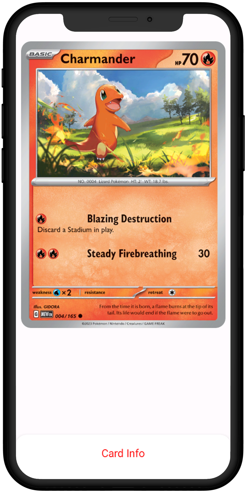
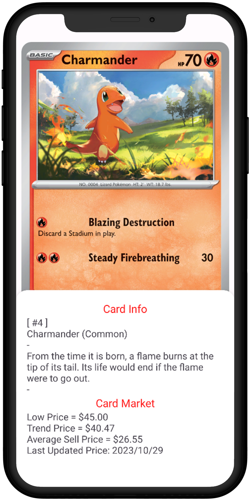

<h1 align="center">
  <🐣> PokeStats
</h1>

  Mobile app to browse sets and cards from <em>PokemonTCG</em>.
   
  Built with <strong>Retrofit</strong> — powered by the <a href="https://pokemontcg.io">PokemonTCG.io</a> API ⚡

## 🎨 UI Design

|                                                                              Sets Screen                                                                               |                                                                               Cards Screen                                                                                |                                                                                 Details Screen                                                                                  |                                                                                Sheets Screen                                                                                 |
| :--------------------------------------------------------------------------------------------------------------------------------------------------------------------: | :-----------------------------------------------------------------------------------------------------------------------------------------------------------------------: | :-----------------------------------------------------------------------------------------------------------------------------------------------------------------------------: | :--------------------------------------------------------------------------------------------------------------------------------------------------------------------------: |
| <picture><source media="(prefers-color-scheme: dark)" srcset="docs/imgs/dark/screen-sets.png"></picture> | <picture><source media="(prefers-color-scheme: dark)" srcset="docs/imgs/dark/screen-cards.png"></picture> | <picture><source media="(prefers-color-scheme: dark)" srcset="docs/imgs/dark/screen-details.png"></picture> | <picture><source media="(prefers-color-scheme: dark)" srcset="docs/imgs/dark/screen-sheets.png"></picture> |
