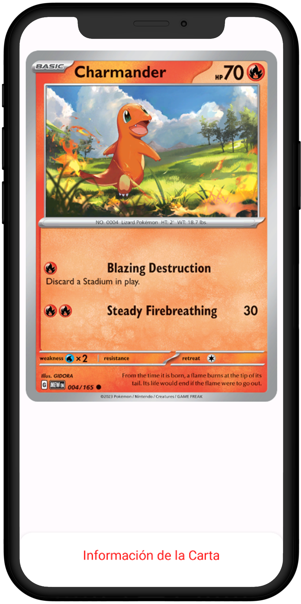
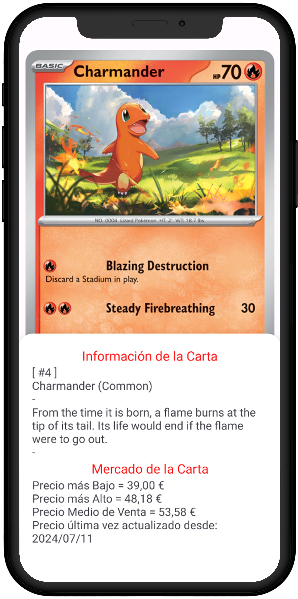

<h1 align="center">
  <> PokeStats
</h1>

## Resumen Proyecto

PokeStats es una aplicación móvil que permite a los usuarios buscar los sets y sus respectivas cartas disponibles en **PokemonTCG**.

Esta aplicación aprovecha la funcionalidad de la API de [PokemonTCG.io](https://pokemontcg.io).

La manipulación de la API se realiza a través de [Retrofit](https://square.github.io/retrofit).

 

##  Diseño de UI

|                                                                              Pantalla Sets                                                                               |                                                                               Pantalla Cartas                                                                                |                                                                                    Pantalla Detalles                                                                                     |                                                                                   Pantalla Fichas                                                                                    |
| :----------------------------------------------------------------------------------------------------------------------------------------------------------------------: | :--------------------------------------------------------------------------------------------------------------------------------------------------------------------------: | :--------------------------------------------------------------------------------------------------------------------------------------------------------------------------------------: | :----------------------------------------------------------------------------------------------------------------------------------------------------------------------------------: |
| <picture><source media="(prefers-color-scheme: dark)" srcset="docs/imgs/dark/screen-sets.png"></picture> | <picture><source media="(prefers-color-scheme: dark)" srcset="docs/imgs/dark/screen-cards.png"></picture> | <picture><source media="(prefers-color-scheme: dark)" srcset="docs/imgs/dark/es/screen-details.png"></picture> | <picture><source media="(prefers-color-scheme: dark)" srcset="docs/imgs/dark/es/screen-sheets.png"></picture> |
