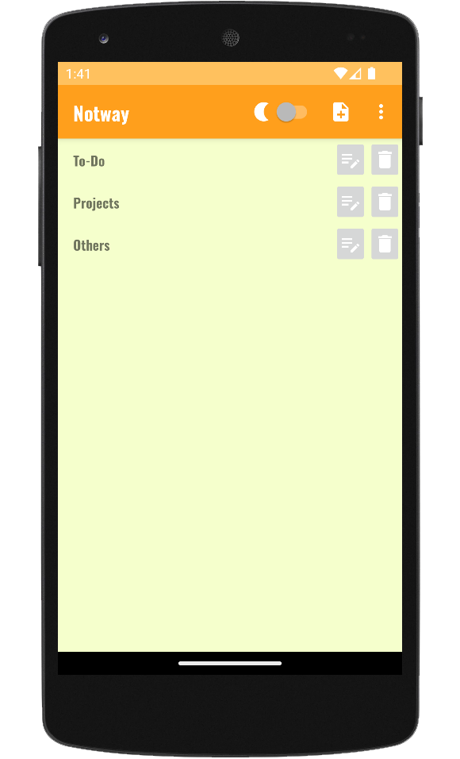
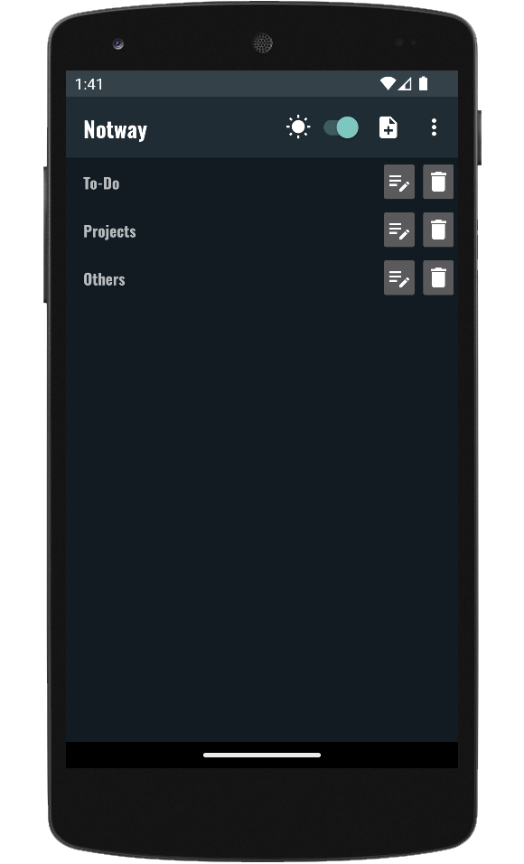
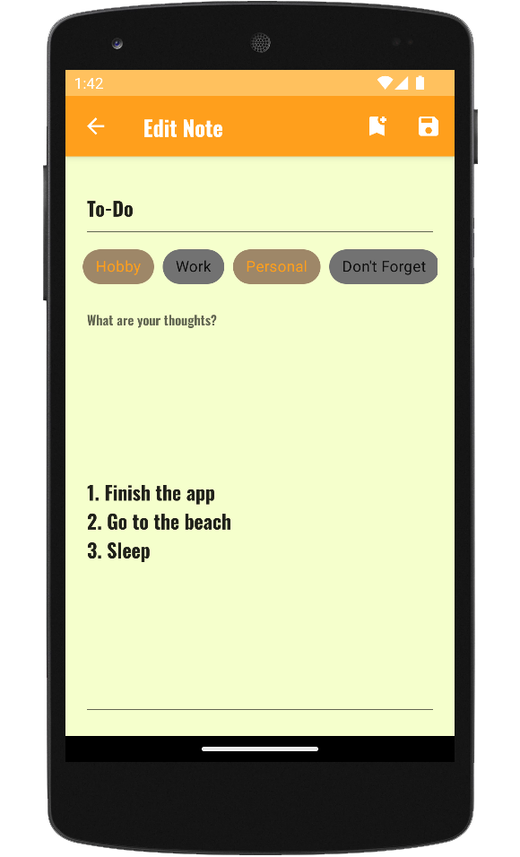
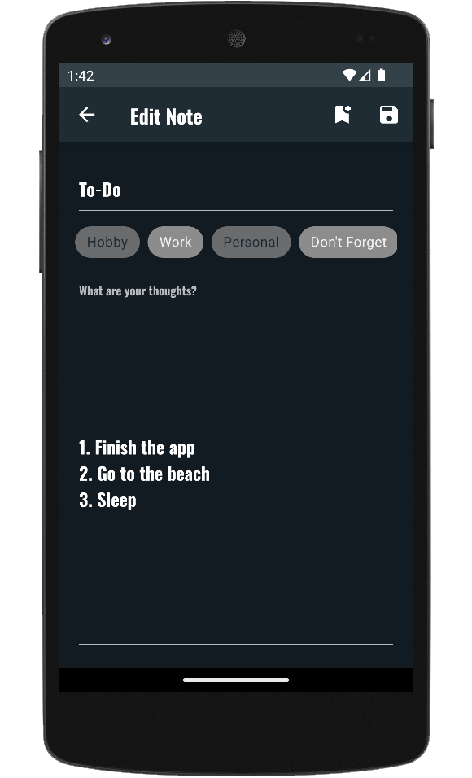
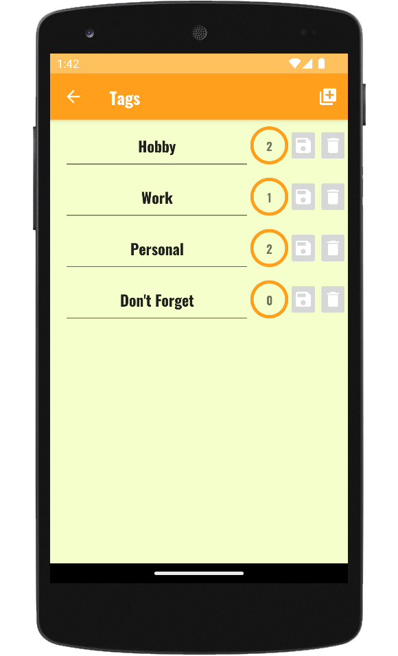
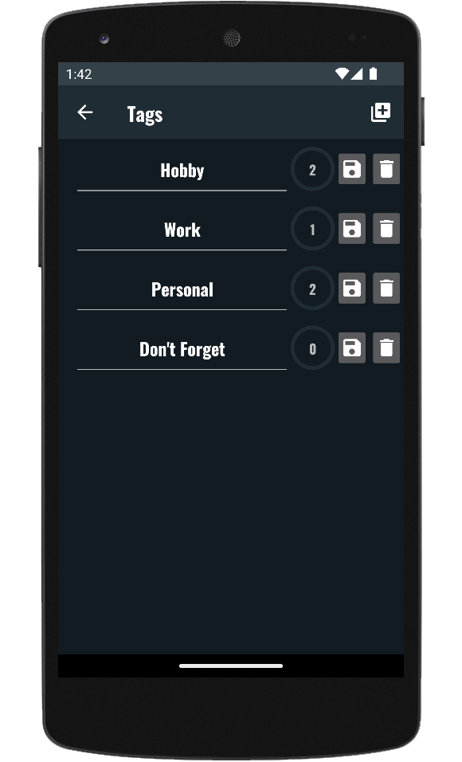

<h1 align="center">
  <📱> Notway
</h1>

## 💊 _[Rakioth][R] & [Quathar][Q]_ ☄️

[Q]: https://github.com/Quathar

[R]: https://github.com/Rakioth

This is an Android Mobile Application for notes called **Notway**.

In this application you can manage your personal notes as well as the tags associated with them.

Database manipulation is done via [Room](https://developer.android.com/jetpack/androidx/releases/room).

 

# 🌆 Views

The application contains 3 different views.

- General View for global notes management.
- Notes View for a specific note management.
- Tags View for global tags management.

All the app's views are shown below with light and dark themes.

## 🗒️ Main View

    
    

## 📝 Notes View

    
    

## 🏷️ Tags View

    
    

