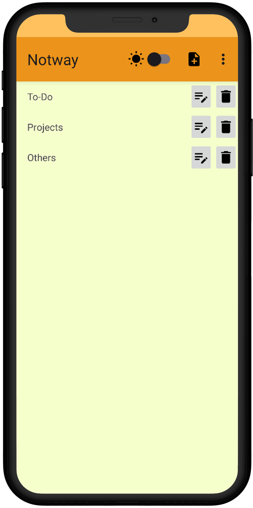
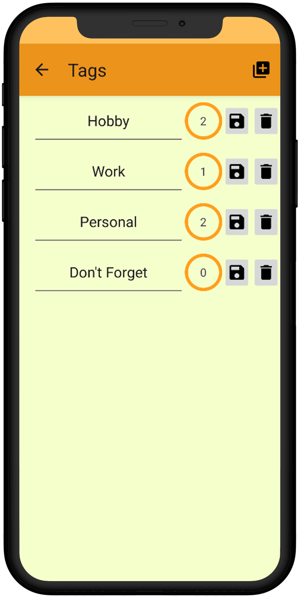
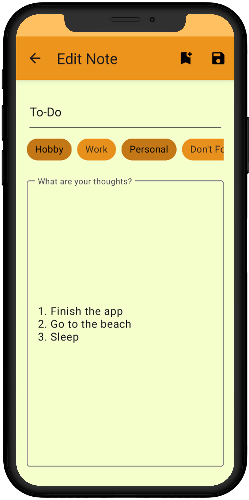

<h1 align="center">
  <> Notway
</h1>

## Project Overview

Notway is a mobile app that allows users to manage their personal notes as well as the tags associated with them.

Seamlessly switch between light and dark themes on the go.

Database manipulation is done via [Room](https://developer.android.com/jetpack/androidx/releases/room?hl=en).

 

##  UI Design

|                                                                                  Notes Screen                                                                                   |                                                                                 Tags Screen                                                                                  |                                                                                 Edit Screen                                                                                  |
| :-----------------------------------------------------------------------------------------------------------------------------------------------------------------------------: | :--------------------------------------------------------------------------------------------------------------------------------------------------------------------------: | :--------------------------------------------------------------------------------------------------------------------------------------------------------------------------: |
| <picture><source media="(prefers-color-scheme: dark)" srcset="docs/imgs/dark/en/screen-notes.png"></picture> | <picture><source media="(prefers-color-scheme: dark)" srcset="docs/imgs/dark/en/screen-tags.png"></picture> | <picture><source media="(prefers-color-scheme: dark)" srcset="docs/imgs/dark/en/screen-edit.png"></picture> |
