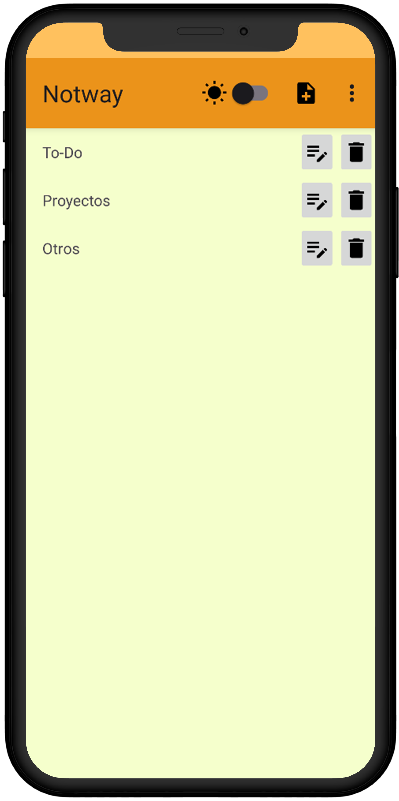
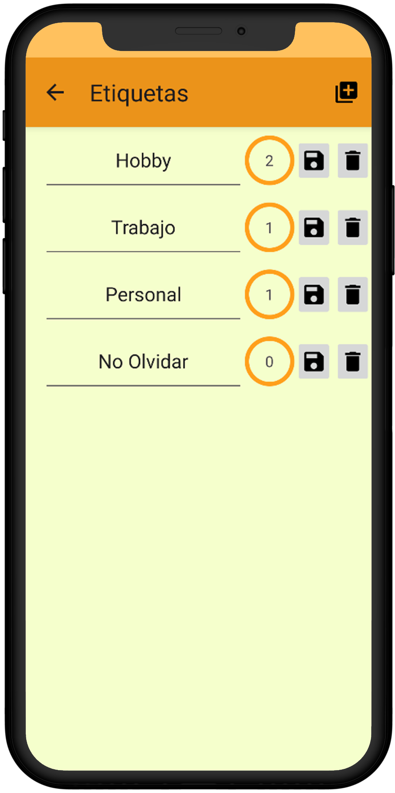
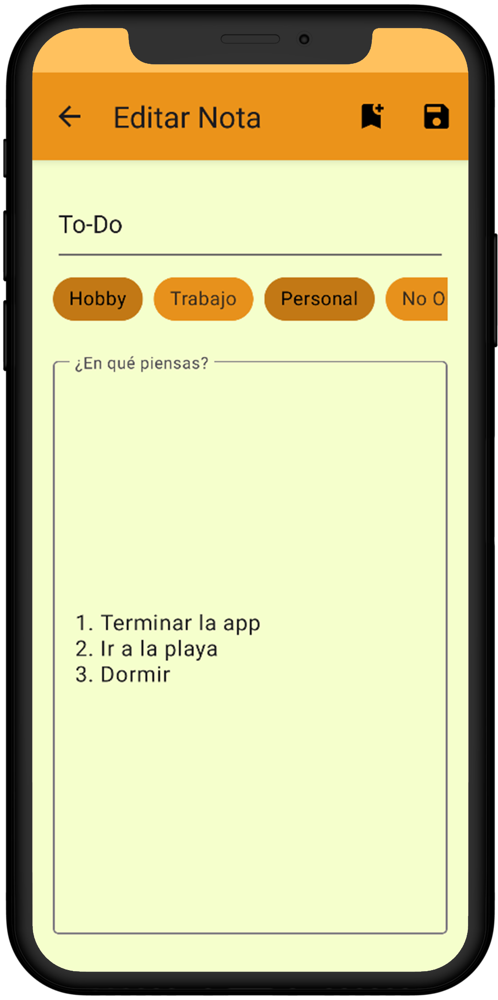

<h1 align="center">
  <> Notway
</h1>

## Resumen Proyecto

Notway es una aplicación móvil que permite a los usuarios gestionar sus notas personales, así como las etiquetas asociadas a ellas.

Permite cambiar sin problemas entre temas claro y oscuro sobre la marcha.

La manipulación de la base de datos se realiza a través de [Room](https://developer.android.com/jetpack/androidx/releases/room?hl=es).

 

##  Diseño de UI

|                                                                                  Pantalla Notas                                                                                   |                                                                                 Pantalla Etiquetas                                                                                  |                                                                                 Pantalla Edición                                                                                  |
| :-------------------------------------------------------------------------------------------------------------------------------------------------------------------------------: | :---------------------------------------------------------------------------------------------------------------------------------------------------------------------------------: | :-------------------------------------------------------------------------------------------------------------------------------------------------------------------------------: |
| <picture><source media="(prefers-color-scheme: dark)" srcset="docs/imgs/dark/es/screen-notes.png"></picture> | <picture><source media="(prefers-color-scheme: dark)" srcset="docs/imgs/dark/es/screen-tags.png"></picture> | <picture><source media="(prefers-color-scheme: dark)" srcset="docs/imgs/dark/es/screen-edit.png"></picture> |
